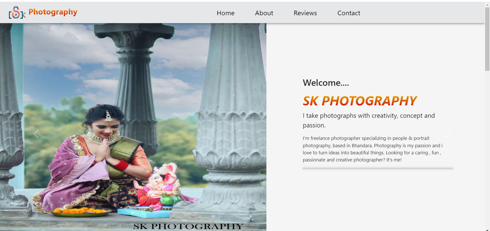

# SK Photography

#### 
SK Photography is a web app for photographers. It helps them show their work, manage bookings, and get feedback from clients. The app is built using the MERN stack (MongoDB, Express.js, React.js, Node.js) to make it easy and smooth for both photographers and their clients. 

 - I developed this project using **MERN stack**.
 
- I Implemented REST-Full APIs with
Express and Node.js to **store and retrieve
user specific riviews in MongoDB**.

- In this project designed to be **user-friendly**,
and focusing on **simplicity**.

## Key Features

- **Showcase Portfolios:**
  - Photographers can upload and display their photos in a gallery.
  - Photos are shown in a nice layout to attract clients.

- **Client Feedback:**
  - Users can leave reviews and feedback for photographers.
  - Feedback helps photographers improve and build trust.

- **Inquiries and Contact:**
  - Clients can contact photographers with questions or requests.
  - A contact form makes communication easy.

- **Event Booking:**
  - Clients can book photographers for events directly through the website.
  - The booking system includes a calendar to manage dates and times.

## Technologies Used

- **Frontend:** React.js, Bootstrap
- **Backend:** Node.js, Express.js
- **Database:** MongoDB
- **Email Integration:** Nodemailer for handling client inquiries

### Source code:-
      https://github.com/achaltelmasre/sk-photography

 ### Live Demo:-
      https://sk-photography.onrender.com/
